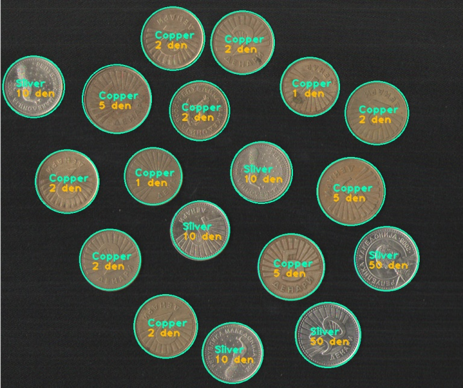

# Automatic detection and recognition of MKD coins from images

We use OpenCV to detect circular coins, and recognise their value by scaling their radii. In order to determine the exact coin,
we have collected a dataset of images of MKD coins, and trained a classifier (MLP) to recognise the material of the coin.
The end product of this program is the sum of coins on the image, and the recognised coins marked on the image.

Classifier train mean accuracy:  100.0
Classifier test mean accuracy:  100.0

======= Summary: =======
Coins detected: 18, MKD 205
